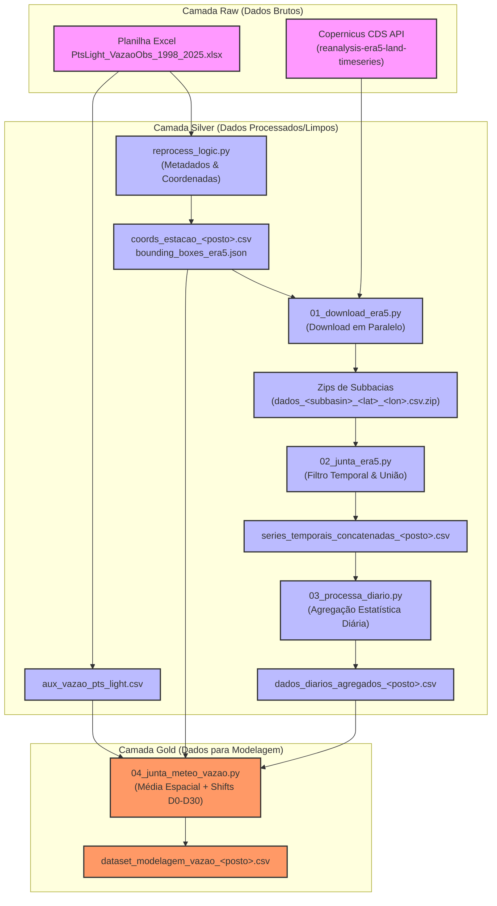

# 💧 UFRJ HydroSense Data Pipeline

Este repositório contém o pipeline completo de processamento de dados hidrológicos e meteorológicos para o projeto **UFRJ HydroSense**. O pipeline adota a **Arquitetura Medallion** (Raw, Silver e Gold) para estruturar os dados e consolidar séries temporais de vazão observada (fornecidas pela Light) com dados meteorológicos do reanálise **ERA5-Land** (via Copernicus CDS API) para fins de modelagem de previsão com Inteligência Artificial.

---

## 🏗️ Arquitetura do Pipeline de Dados

O fluxo de dados transita de forma estruturada desde as planilhas brutas e requisições de API até o dataset final consolidado para treinamento de modelos de IA.



---

## 📁 Estrutura de Diretórios (Arquitetura Medallion)

A organização das pastas reflete o nível de maturidade do processamento dos dados:

```bash
ufrj-hydrosense-data/
├── data/
│   ├── raw_vazao/           # Arquivos de vazão brutos enviados pela equipe (Excel)
│   ├── raw_era5/            # Arquivos ZIP contendo dados meteorológicos horários brutos baixados da API
│   ├── silver_vazao/        # Coordenadas, mapeamentos limpos e série original de vazão em formato CSV
│   ├── silver_era5/         # Séries horárias concatenadas e agregados diários consolidados por posto
│   └── gold/                # Dataset unificado final (Média espacial da meteorologia + alvos futuros D0 a D30)
├── scripts/
│   ├── scripts_era5_ts/     # Sequência do pipeline para processamento da meteorologia
│   ├── reprocess_logic.py   # Script de inicialização da camada Silver de vazão e metadados
│   └── ...                  # Outros scripts analíticos e exploratórios
```

---

## 🚉 Mapeamento dos Postos Ativos

O pipeline foi projetado para operar a nível de **posto/estação de monitoramento**. Cada posto é mapeado para um conjunto de subbacias hidrográficas cujas coordenadas geográficas (centroides) são utilizadas no download e média espacial da meteorologia:

| Posto / Estação | Nome / Bacia correspondente | Subbacias Hidrográficas Mapeadas | Observação |
| :--- | :--- | :--- | :--- |
| **`19098`** | Piraí | `2, 3, 4, 5` | Estação ativa no Rio Piraí |
| **`58350001`**| Piraí (Incremental) | `1, 2, 3, 4, 5, 6, 7, 8` | Herda as subbacias da 19098 de forma incremental |
| **`19094`** | Santa Cecília | `1 a 54` | Cobre todas as 54 subbacias de Santa Cecília |
| *`19097`* | *Inativo / Removido* | - | Excluído no mapeamento final conforme regras de negócio |

---

## ⚙️ Requisitos e Configuração

### 1. Dependências do Python
Certifique-se de possuir o ambiente virtual configurado e as seguintes dependências instaladas:
```bash
pip install pandas openpyxl cdsapi argparse
```

### 2. Credenciais da API do Copernicus (CDS)
Para o download automático dos dados do **ERA5-Land**, você precisa criar uma conta no [Copernicus Climate Data Store](https://cds-beta.climate.copernicus.eu/) e obter sua chave de API.

Crie um arquivo chamado `.cdsapirc` na pasta padrão do seu usuário (`~/.cdsapirc` no macOS/Linux ou `%USERPROFILE%\.cdsapirc` no Windows) com a seguinte estrutura:

```text
url: https://cds-beta.climate.copernicus.eu/api
key: SEU-UID-DO-COPERNICUS:SUA-API-KEY-AQUI
```

---

## 🚀 Execução do Pipeline Passo a Passo

O processamento completo é realizado executando a sequência de comandos abaixo a partir da raiz do projeto:

### Passo 0: Inicialização de Metadados e Limpeza
Prepara os arquivos de mapeamento, extrai as coordenadas específicas por estação ativa a partir da planilha Excel e gera as caixas delimitadoras (*bounding boxes*).
```bash
python scripts/reprocess_logic.py
```
* **Entrada**: `data/raw_vazao/PtsLight_VazaoObs_1998_2025.xlsx`
* **Saída**:
  * `data/silver_vazao/aux_vazao_pts_light.csv`
  * `data/silver_vazao/aux_mapeamento_subbacias.csv` (Exclui 19097 e ajusta as bacias das demais estações)
  * `data/silver_vazao/coords_estacao_<STATION_ID>.csv` (Coordenadas Lat/Lon de cada subbacia)
  * `data/silver_vazao/bounding_boxes_era5.json`

---

### Passo 1: Download de Dados Meteorológicos (ERA5-Land)
Baixa as séries temporais horárias de variáveis meteorológicas para as coordenadas das subbacias de um posto específico. O script utiliza multithreading (`ThreadPoolExecutor`) para gerenciar as requisições em paralelo.
```bash
python scripts/scripts_era5_ts/01_download_era5.py --station <STATION_ID>
```
*Substitua `<STATION_ID>` pelo ID desejado (ex: `19098`, `58350001` ou `19094`).*

* **Período**: 01/01/1998 a 30/12/2025.
* **Variáveis baixadas**:
  * `2m_temperature` (Temperatura do ar a 2m)
  * `2m_dewpoint_temperature` (Temperatura do ponto de orvalho a 2m)
  * `total_precipitation` (Precipitação total acumulada)
  * `surface_solar_radiation_downwards` (Radiação solar global incidente)
  * `10m_u_component_of_wind` / `10m_v_component_of_wind` (Componentes U e V do vento a 10m)
* **Saída**: `data/raw_era5/dados_<subbasin>_<lat>_<lon>.csv.zip`

---

### Passo 2: Consolidação Horária da Estação
Abre os arquivos ZIP de cada subbacia associada ao posto escolhido, mescla suas variáveis horárias, filtra o período correto (1998-2025) e gera uma tabela consolidada.
```bash
python scripts/scripts_era5_ts/02_junta_era5.py --station <STATION_ID>
```
* **Entrada**: Pasta `data/raw_era5/` + coordenadas geradas no Passo 0.
* **Saída**: `data/silver_era5/series_temporais_concatenadas_<STATION_ID>.csv`

---

### Passo 3: Agregação Estatística Diária
Reduz a frequência dos dados de horária para diária, calculando estatísticas agregadas cruciais para a hidrologia:
* **Temperatura, Vento, Ponto de Orvalho e Radiação**: Médias (`mean`), Máximos (`max`) e Mínimos (`min`) diários.
* **Precipitação (`tp`)**: Soma acumulada diária (`sum`), Máximo (`max`) e Mínimo (`min`).
```bash
python scripts/scripts_era5_ts/03_processa_diario.py --station <STATION_ID>
```
* **Entrada**: `data/silver_era5/series_temporais_concatenadas_<STATION_ID>.csv`
* **Saída**: `data/silver_era5/dados_diarios_agregados_<STATION_ID>.csv`

---

### Passo 4: Integração Meteorologia + Vazões e Geração de Targets (Gold)
Esta etapa consolida o dataset final pronto para modelagem preditiva por Inteligência Artificial:
1. **Agregação Espacial**: Calcula a média espacial das variáveis meteorológicas de todas as subbacias pertencentes à bacia do posto (representando o estado meteorológico médio diário da bacia).
2. **Qualidade Estrita**: Valida se todas as subbacias da estação estão presentes na camada Silver.
3. **Criação de Variáveis Alvo (Look-ahead Targets)**: Gera as colunas de vazão futura utilizando deslocamentos temporais (*shifts*) de **D0 a D30** (vazão de hoje até daqui a 30 dias).
4. **Merge**: Realiza uma junção interna (`inner join`) pela data.
```bash
python scripts/scripts_era5_ts/04_junta_meteo_vazao.py --station <STATION_ID>
```
* **Entradas**:
  * `data/silver_era5/dados_diarios_agregados_<STATION_ID>.csv`
  * `data/silver_vazao/aux_vazao_pts_light.csv`
  * `data/silver_vazao/coords_estacao_<STATION_ID>.csv`
* **Saída**: **`data/gold/dataset_modelagem_vazao_<STATION_ID>.csv`**

---

## 📈 Formato do Dataset Final (Gold)

O arquivo de saída na pasta **Gold** é estruturado com as seguintes colunas, ideais para o treinamento de modelos supervisionados:

1. **`day`**: Data do registro (frequência diária).
2. **Variáveis Meteorológicas Médias da Bacia** (ex: `t2m_mean`, `tp_sum`, `ssrd_max`, etc.).
3. **Variáveis de Vazão Preditiva (Alvos)**:
   * `Vazao_D0`: Vazão observada no dia atual ($t$).
   * `Vazao_D1`: Vazão observada no dia seguinte ($t+1$).
   * `Vazao_D2` a `Vazao_D29`: Vazão nos dias subsequentes.
   * `Vazao_D30`: Vazão observada daqui a 30 dias ($t+30$).

Com essa estrutura, os modelos de IA (como redes neurais LSTM, XGBoost ou regressores clássicos) conseguem aprender a mapear as condições meteorológicas médias observadas na bacia até o dia $t$ para estimar a vazão do posto ao longo de um horizonte de 30 dias adiante.
